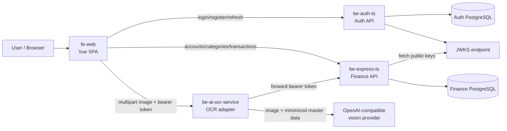
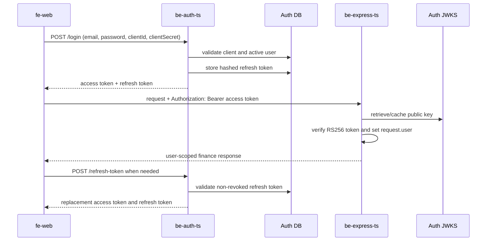
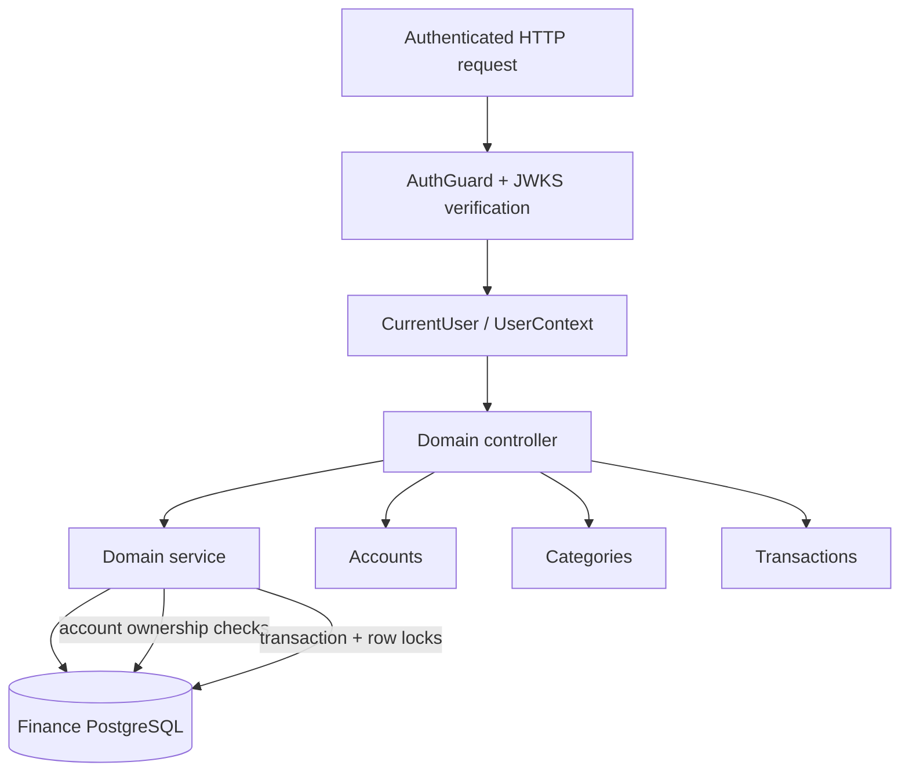
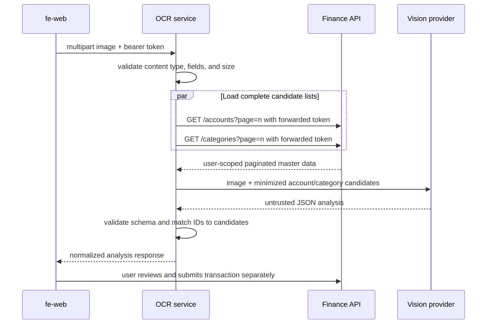
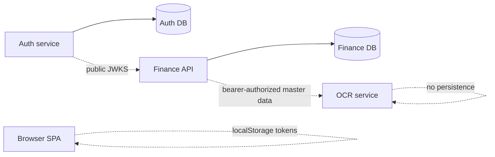

# FinTrack Labs Architecture Draft

Status: draft for review

This document describes the current architecture of the four application repositories in the workspace:

- `be-auth-ts`: authentication and token issuer
- `be-express-ts`: finance domain API
- `be-ai-ocr-service`: stateless receipt/image analysis adapter
- `fe-web`: Vue web application

`be-api-client-test` is treated as an integration-test/API collection repository, not as a runtime application.

## 1. System Context

The system is a distributed application with three HTTP services and two logical database ownership boundaries. The browser is the only client-facing application. The core API and OCR service do not share database tables.

## 2. Repository Responsibilities

### `be-auth-ts`

- Fastify and TypeScript service, normally listening on port `8081`.
- Owns users, clients, groups, user-group assignments, and refresh tokens through Prisma.
- Registers users and authenticates active users with email/password plus client credentials.
- Signs one-hour RS256 access tokens.
- Stores only a SHA-256 hash of each refresh token and supports logout/revocation.
- Publishes the public key through `/.well-known/jwks.json`.
- Current route prefix is `/auth/api` by default.

Primary entry points:

- [be-auth-ts/src/index.ts](be-auth-ts/src/index.ts)
- [be-auth-ts/src/routes/auth.routes.ts](be-auth-ts/src/routes/auth.routes.ts)
- [be-auth-ts/src/services/auth.service.ts](be-auth-ts/src/services/auth.service.ts)
- [be-auth-ts/src/plugins/prisma.ts](be-auth-ts/src/plugins/prisma.ts)

### `be-express-ts`

- NestJS application running on Fastify, normally listening on port `8080`.
- Validates bearer tokens locally using the auth service JWKS; it does not call the auth service for every request.
- Owns finance data in PostgreSQL through TypeORM.
- Provides authenticated modules for health, accounts, categories, and transactions.
- Scopes account, category, and transaction reads/writes by the `userId` extracted from the verified JWT.
- Uses database transactions and pessimistic account locks when creating transactions or changing balances.
- Uses common audit and soft-delete entities/subscribers.

Primary entry points:

- [be-express-ts/src/main.ts](be-express-ts/src/main.ts)
- [be-express-ts/src/app.module.ts](be-express-ts/src/app.module.ts)
- [be-express-ts/src/modules/auth/guards/auth/auth.guard.ts](be-express-ts/src/modules/auth/guards/auth/auth.guard.ts)
- [be-express-ts/src/modules/accounts/accounts.controller.ts](be-express-ts/src/modules/accounts/accounts.controller.ts)
- [be-express-ts/src/modules/categories/categories.controller.ts](be-express-ts/src/modules/categories/categories.controller.ts)
- [be-express-ts/src/modules/transactions/transactions.controller.ts](be-express-ts/src/modules/transactions/transactions.controller.ts)

### `be-ai-ocr-service`

- Stateless Fastify service, normally listening on port `3000`.
- Accepts one JPEG, PNG, or WebP image through `POST /v1/ocr/analyze`.
- Requires the caller's bearer token and forwards it only to the configured finance API.
- Reads all paginated accounts and categories for the authenticated user.
- Sends a minimized candidate set plus the image to an OpenAI-compatible vision/chat-completions endpoint.
- Validates the provider JSON response and replaces AI-selected names/IDs with values from trusted backend candidates.
- Does not create transactions, persist images, or persist OCR results.

Primary entry points:

- [be-ai-ocr-service/src/server.js](be-ai-ocr-service/src/server.js)
- [be-ai-ocr-service/src/app.js](be-ai-ocr-service/src/app.js)
- [be-ai-ocr-service/src/routes/analyze.js](be-ai-ocr-service/src/routes/analyze.js)
- [be-ai-ocr-service/src/backend/master-data-client.js](be-ai-ocr-service/src/backend/master-data-client.js)
- [be-ai-ocr-service/src/ai/ai-client.js](be-ai-ocr-service/src/ai/ai-client.js)

### `fe-web`

- Vue 3 SPA built and served by Vite.
- Uses Vue Router for navigation and Pinia for authentication state only.
- Uses three Axios clients: auth API, core API, and OCR service.
- Stores access and refresh tokens in browser `localStorage`.
- Adds the access token to service requests, refreshes proactively and after a `401`, then retries the original request once.
- Fetches domain data per view rather than keeping accounts, categories, and transactions in a global store.
- OCR results prefill a transaction draft; OCR does not submit a transaction automatically.

Primary entry points:

- [fe-web/src/main.ts](fe-web/src/main.ts)
- [fe-web/src/router/index.ts](fe-web/src/router/index.ts)
- [fe-web/src/services/api.ts](fe-web/src/services/api.ts)
- [fe-web/src/services/token-refresh.service.ts](fe-web/src/services/token-refresh.service.ts)
- [fe-web/src/services/ocr.service.ts](fe-web/src/services/ocr.service.ts)

## 3. Authentication and Request Flow

Token trust boundaries:

- `be-auth-ts` is the token issuer and owns private signing keys.
- `be-express-ts` is a token consumer and authorizes data access from the token subject.
- `be-ai-ocr-service` does not verify the JWT itself; it delegates authorization to `be-express-ts` by forwarding the original bearer token.
- `fe-web` decodes token payloads only for display/session timing. It must not be treated as the authority for authorization.

The JWT currently uses issuer `fintrack-be-auth`, algorithm `RS256`, a key ID, subject `userId`, and an approximately one-hour expiry. The core API's verification configuration should explicitly enforce issuer, audience, and algorithm before production use.

## 4. Finance Domain Flow

Current domain ownership:

- Accounts: user-owned account records, balances, currency, account type, and optimistic version column.
- Categories: system or user-owned categories with parent/child relationships.
- Transactions: expense, income, transfer, and balance-adjustment records, with optional account/category/receipt metadata.
- Cross-account transfers update both account balances inside one database transaction.
- Pagination is returned as `{ data, page, limit, totalItems, pageCount }`.

## 5. OCR Flow

The OCR service is an adapter, not a transaction command service. Candidate IDs and names are authoritative only when they came from the finance API. The AI provider receives no bearer token.

## 6. Main HTTP Contracts

| Boundary | Contract | Ownership |
|---|---|---|
| Browser -> Auth | `POST /auth/api/login`, `/user/register`, `/refresh-token`, `/logout` | `be-auth-ts` |
| Browser -> Core | `/api/v1/accounts`, `/categories`, `/transactions`, `/health` | `be-express-ts` |
| Core -> Auth | `GET /auth/api/.well-known/jwks.json` | `be-auth-ts` |
| Browser -> OCR | `POST /v1/ocr/analyze` multipart `image`, optional `documentType`, `locale` | `be-ai-ocr-service` |
| OCR -> Core | paginated `GET /accounts` and `GET /categories` with forwarded bearer token | `be-express-ts` |
| OCR -> AI | OpenAI-compatible `POST /chat/completions` | External provider |

The API collection in [be-api-client-test](be-api-client-test) documents representative local calls. Its environment currently uses auth at `http://127.0.0.1:8081/auth/api` and core API at `http://localhost:8080/api/v1`.

## 7. Data and Deployment Boundaries

Recommended runtime topology:

- Serve `fe-web` from a browser-accessible HTTPS origin.
- Keep `be-auth-ts`, `be-express-ts`, and `be-ai-ocr-service` behind HTTPS and restrict CORS to the actual frontend origin.
- Keep the AI API key and backend service URLs server-side in OCR configuration.
- Give auth and finance services separate database credentials and migrations.
- Use health endpoints for process checks; add dependency/readiness checks for database, JWKS, and AI availability where deployment orchestration needs them.

## 8. Important Review Points

These are architectural questions or risks found in the current implementation, not proposed fixes yet:

1. **JWT verification policy:** The core JWKS verifier currently calls `jwtVerify` with the remote key set, but issuer, audience, and accepted algorithm should be explicit and consistent with auth configuration.
2. **Key lifecycle:** Auth generates key files at startup when absent. Production needs durable key storage, rotation, and a JWKS strategy that can publish old public keys while existing tokens expire.
3. **Browser token storage:** Access and refresh tokens are in `localStorage`, which increases impact from an XSS vulnerability. HttpOnly secure cookies or a deliberate threat-model exception should be reviewed.
4. **Client secret exposure:** `VITE_CLIENT_SECRET` is compiled into the browser bundle. This is not a secret in a browser architecture; client authentication and rate limiting should be designed accordingly.
5. **CORS consistency:** Auth currently allows wildcard CORS while core and OCR use explicit origins. Production policy should be consistent and environment-driven.
6. **Pagination contract:** OCR expects `pageCount` and fetches pages recursively. The backend must keep page numbering and response fields stable, and the OCR path needs bounded latency for large master-data sets.
7. **OCR reliability:** OCR is synchronous and sends base64 image data to the AI provider. Timeouts, provider payload limits, concurrency limits, and cost controls should be part of deployment design.
8. **Transaction invariants:** The transaction service protects account balance updates with database transactions and row locks. Foreign-key constraints and category ownership rules should be verified at the database and service layers.
9. **Analytics status:** The dashboard currently uses deterministic mock data, so it is not yet an authoritative reporting surface backed by the finance API.
10. **Contract drift:** DTOs are replicated in the frontend and OCR service rather than generated from a shared schema. A versioned OpenAPI or shared contract strategy would reduce silent mismatch risk.

## 9. Decisions Needed Before Implementation Work

- Confirm the canonical public URLs and prefixes for local, staging, and production.
- Confirm whether auth and finance use separate PostgreSQL databases or separate schemas in one PostgreSQL instance.
- Decide the JWT issuer/audience policy and signing-key rotation process.
- Decide the browser session strategy: current localStorage model versus secure cookie/BFF model.
- Define OCR provider limits, expected image volume, timeout budget, and fallback behavior.
- Decide whether dashboard analytics belongs in `be-express-ts` and define its first read model.
- Choose how API contracts are versioned and shared across frontend, core API, and OCR.
